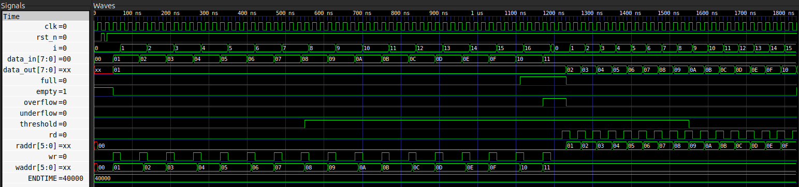

# FIFO Memory
A Synchronous FIFO Implementation for FPGA-Based Systems


---

## Overview

This project implements a synchronous **FIFO (First-In, First-Out)** memory structure in Verilog HDL, designed for FPGA-based digital systems.

Originally based on a reference design from FPGA4Student, the implementation has been refactored with a cleaner module structure, parametrizable depth and width, improved status flag logic, and thoroughly commented source files aimed at study and understanding.

The design is organized into four submodules: write controller, read controller, memory array, and status controller. All wired together through a top-level module. Each submodule is documented inline with explanations of both the *what* and the *why* behind the logic.

Beyond being a functional FIFO, the project demonstrates several core digital design concepts:

- Synchronous sequential logic with asynchronous active-low reset
- Pointer-based full/empty detection using an extra MSB lap counter
- Combinational vs. registered status flag generation
- Parametric design for reusable and scalable hardware
- Self-checking testbench methodology with reference memory comparison

---

## Repository Structure

```Text
FIFO_Memory/
│
├── images/
│   └── waveform.png
│
├── src/
│   └── fifo.v
│
├── tb/
│   └── fifo_tb.v
│
├── License
│
└── README.md
```

---

## FIFO Specifications

| Parameter   | Value                        |
| ----------- | ---------------------------- |
| Depth       | 16 entries                   |
| Data width  | 8 bits                       |
| Threshold   | 8 entries (configurable)     |
| Reset       | Asynchronous, active-low     |
| Write       | Synchronous (rising edge)    |
| Read output | Asynchronous (combinational) |

---

## Status Signals

| Signal      | Description                                               |
| ----------- | --------------------------------------------------------- |
| `full`      | Asserted when the FIFO has no remaining capacity          |
| `empty`     | Asserted when no data is stored in the FIFO               |
| `threshold` | Asserted when occupancy reaches the configured threshold  |
| `overflow`  | Asserted when a write is attempted while the FIFO is full |
| `underflow` | Asserted when a read is attempted while the FIFO is empty |

---

## How It Works

### Full / Empty Detection

The pointers are one bit wider than required to index the storage array. That extra MSB acts as a **lap counter**, it flips every time a pointer wraps past the last slot.

- **Empty:** both pointers have the same MSB and the same lower index → the write pointer has not lapped the read pointer.
- **Full:** the MSBs differ but the lower index is the same → the write pointer has lapped exactly once.

This technique avoids ambiguity when both pointers land on the same index after wrap-around.

### Pointer Width

`PTR_W` is computed automatically from `DEPTH` using `$clog2`:

```verilog
localparam PTR_W = $clog2(DEPTH) + 1;
```

Changing `DEPTH` adjusts the pointer width without touching any other logic.

### Overflow and Underflow

Both flags are **registered** (sequential), not combinational:

- **Overflow** is set when `wr=1` while `full=1` and no read is occurring simultaneously. It clears on the next successful read.
- **Underflow** is set when `rd=1` while `empty=1` and no write is occurring simultaneously. It clears on the next successful write.

---

## Module Hierarchy

```text
fifo (top-level)
├── wr_ctrl      — write enable gating and pointer advance
├── rd_ctrl      — read enable gating and pointer advance
├── mem_array    — 16×8 register array, sync write / async read
└── status_ctrl  — full, empty, threshold, overflow, underflow
```
---

## Parameters

All key design values are exposed as parameters on the top-level module, making the design reusable without editing internal logic:

```verilog
module fifo #(
  parameter DEPTH     = 16,   // Number of storage slots
  parameter WIDTH     = 8,    // Data word width in bits
  parameter THRESHOLD = 8     // Occupancy level for threshold flag
)
```

---

## Simulation

### Requirements

- VSCode: source-code editor
- Icarus Verilog: open-source Verilog simulator
- GTKWave: waveform viewer (optional)

### Running the Testbench

**1. Compile:**

```bash
iverilog -o sim_fifo src/fifo.v tb/fifo_tb.v
```

**2. Run:**

```bash
vvp sim_fifo
```

**3. View waveform (optional):**

```bash
gtkwave dump.vcd
```

### What the Testbench Does

The testbench drives the DUT through a complete write/read cycle:

1. Applies an asynchronous reset, including a mid-run glitch to verify recovery
2. Writes **17 words** into a 16-slot FIFO - the extra write intentionally triggers `overflow`
3. Reads **17 words** back - the extra read intentionally triggers `underflow`
4. A **self-checking mechanism** mirrors every write into a local reference memory and compares each `data_out` against the expected value, reporting the result per transaction
5. A `$monitor` block logs every signal change automatically, producing a timestamped trace of the full simulation

### Expected Output

```text
  ============================================
           FIFO SIMULATION — START
  ============================================
  Depth: 16 | Width: 8-bit | Threshold: 8
  --------------------------------------------

    TIME(ns)  WR  RD   DATA_IN  FULL  EMPTY  OVERFLOW  UNDERFLOW
  --------------------------------------------
         0    0    0    0x00      0      1       0          0
        50    1    0    0x01      0      0       0          0
       ...
      1100    1    0    0x10      1      0       0          0
      1170    1    0    0x11      1      0       1          0   <- overflow
      ...
  [READ 01]  got=0x01  expected=0x01  --> PASS
  [READ 02]  got=0x02  expected=0x02  --> PASS
  [READ 03]  got=0x03  expected=0x03  --> PASS
  ...
  [READ 16]  got=0x10  expected=0x10  --> PASS

  ============================================
   RESULT: ALL 16 READS PASSED
  ============================================
```

### Waveform



---

## Future Improvements

- Add a formal property to verify the full/empty flag correctness
- Parametric testbench that adapts to any `DEPTH` and `WIDTH`
- Synthesis constraints file for common FPGA families
- Gray-code pointer variant for future CDC (clock domain crossing) exploration

---

## License

This project is open-source and available under the MIT License.

---

## Additional Notes

Developed as a digital design study project.
  
Based on a reference implementation by [FPGA4Student](https://www.fpga4student.com).

